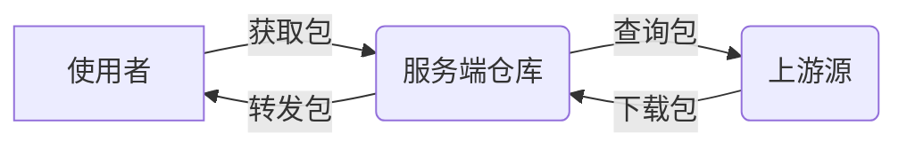

# 使用Verdaccio搭建npm私有仓库

## 环境准备

- Node.js `v12` 或者更高
- Node包管理器 `npm` 或 `yarn`
- Node应用进程管理器 `pm2`

## 安装

```shell
# 使用NPM
npm install -g verdaccio
# 使用Yarn
yarn global add verdaccio
````

## 运行

### 直接运行

```shell
$> verdaccio
warn --- config file  - /home/.config/verdaccio/config.yaml
warn --- http address - http://localhost:4873/ - verdaccio/5.0.0
```

| 参数              | 默认值                         | 示例           | 描述             |
| ----------------- | ------------------------------ | -------------- | ---------------- |
| --listen \ **-l** | 4873                           | -p 7000        | HTTP 监听端口    |
| --config \ **-c** | ~/.local/verdaccio/config.yaml | ~./config.yaml | 配置文件路径     |
| --info \ **-i**   |                                |                | 打印本地环境信息 |

### 使用PM2运行

```shell
# pm2 start verdaccio --name <app_name>
# app_name 由您决定，合理的app_name可以使得PM2管理更加便携
# 下方案例使用 "verdaccio" 作为 app_name 使用

# 通过PM2启动应用
$ pm2 start verdaccio --name verdaccio
[PM2] Applying action restartProcessId on app [verdaccio]
[PM2] [verdaccio] ✓
[PM2] Process successfully started

# 重启应用
$ pm2 restart verdaccio
[PM2] Applying action restartProcessId on app [verdaccio]
[PM2] [verdaccio] ✓

# 停止应用
$ pm2 stop verdaccio
[PM2] Applying action stopProcessId on app [verdaccio]
[PM2] [verdaccio] ✓

# 查看应用列表
$ pm2 list
```

## 配置

在一般情况下，配置文件位于 `用户目录/.config/verdaccio/config.yaml`

例：`/root/.config/verdaccio/config.yaml`

### 常用配置项

```yaml
# 服务监听端口
listen: 0.0.0.0:8070
# 包存储路径
storage: ./storage
# 网页端
web:
	title: 你的站点名字
# 国际化
i18n:
	web: zh-CN
# 包上游（此仓库不存在这些包时，会向上游获取）
uplinks:
  npmjs:
    url: https://registry.npmjs.org/
    timeout: 10s
  yarn:
    url: https://registry.yarnpkg.com/
    timeout: 10s
  taobao:
    url: https://r.npm.taobao.org/
    timeout: 10s
# 包
packages:
  '@*/*':
    # scoped packages
    access: $all
    publish: $authenticated
    unpublish: $authenticated
    # 使用淘宝源作为代理
    proxy: taobao
```

### 使用nginx代理相关配置项

```nginx
#PROXY-START/
location  ~* \.(php|jsp|cgi|asp|aspx)$
{
    proxy_pass http://0.0.0.0:8070;
    proxy_set_header Host $host;
    proxy_set_header X-Real-IP $remote_addr;
    proxy_set_header X-Forwarded-For $proxy_add_x_forwarded_for;
    proxy_set_header REMOTE-HOST $remote_addr;
}
location /
{
    proxy_pass http://0.0.0.0:8070;
    proxy_set_header Host $host;
    proxy_set_header X-Real-IP $remote_addr;
    proxy_set_header X-Forwarded-For $proxy_add_x_forwarded_for;
    proxy_set_header REMOTE-HOST $remote_addr;
    
    add_header X-Cache $upstream_cache_status;
    
    #Set Nginx Cache
    
    add_header Cache-Control no-cache;
    expires 12h;
}

#PROXY-END/
```


## 常见问题 / 提示

### 安装时提示Node.js版本不符合要求

```shell
error xxx@x.x.x: The engine "node" is incompatible with this module. Expected version "^12.22.0 || ^14.17.0 || >= 16.0.0". Got "14.15.1"
error Found incompatible module.
```

尝试使用nvm切换提示中出现的版本nodejs版本，例如：`14.17.0`

### URL显示异常

使用Nginx反向代理时，尽量使用经过代理后的域名访问，否则可能导致URL显示为第一次访问进来时用的URL；

当出现此问题时，可以通过重启应用解决。

### 使用者仓库源设置

当服务端网络带宽并不富裕时，强烈不建议将仓库源设置为此服务端仓库，这会导致使用者在安装上游包时，服务端网络对上游包转发下载速度造成瓶颈。



---

分离

## 包使用者配置

以下使用 `npm.aeroz.cn` 作为演示仓库地址，使用 `@zr-frontend` 作为包域

### 使用verdaccio作为包源（不建议）

```shell
# npm
npm set registry http://npm.aeroz.cn/
# yarn
yarn config set registry http://npm.aeroz.cn/
```

### 通过Scope域，为指定域包设置包源（建议）

打开 `.npmrc` 

```shell
# Linux/Unix
/用户/.npmrc
# Windows
C:/User/用户/.npmrc
```

加入配置项

```
@zr-frontend:registry=http://npm.aeroz.cn/
```

## 包开发者配置

```shell
# 注册账号
$> npm adduser --registry http://npm.aeroz.cn/
npm notice Log in on http://npm.aeroz.cn/
# 设置用户名
Username:
$> Lee
# 设置密码
Password:
$> **********
# 设置邮箱 (将会被公开)
Email:
$> lee@aeroz.cn
# 完成
Logged in as Lee on http://npm.aeroz.cn/.


# 设置密码
$> npm profile set password --registry http://npm.aeroz.cn/
# 输入当前密码
Current password:
$> **********
# 输入新密码
New password:
$> *********
# 重复密码
Again:
$> *********
# 完成
Set password
```