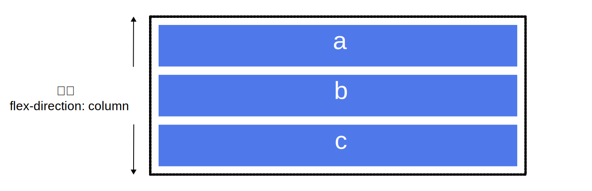
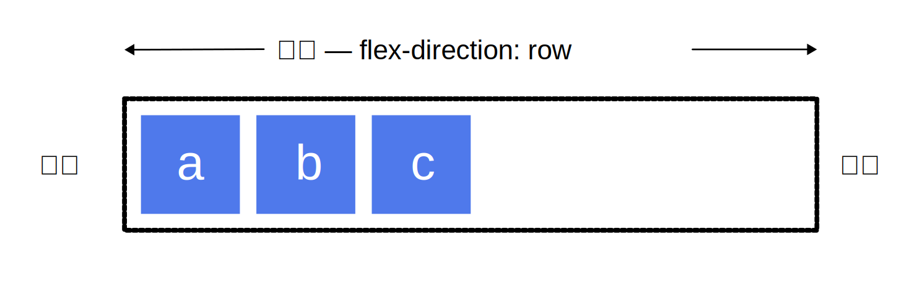

# Flex 布局

> **前言**
>
> 布局的传统解决方案，基于盒状模型，依赖 `display` 属性 + `position` 属性 + `float` 属性。它对于那些特殊布局非常不方便，比如，垂直居中就不容易实现。
>
> 2009年，W3C 提出了一种新的方案：Flex 布局，可以简便、完整、响应式地实现各种页面布局。目前已经得到了所有浏览器的支持。

Flex 是 Flexible Box 的缩写，意为"弹性布局"，用来为盒状模型提供最大的灵活性。

它的目标是提供一个更有效地布局、对齐方式，并且能够使父元素在子元素的大小未知或动态变化情况下仍然能够分配好子元素之间的间隙。

主要思想是使父元素能够调整子元素的宽度、高度、排列方式，从而更好的适应可用的布局空间。

设定为flex布局的元素能够放大子元素使之尽可能填充可用空间，也可以收缩子元素使之不溢出。


## 基本概念

采用 Flex 布局的元素，称为 Flex 容器（flex container），简称"容器"。它的所有子元素自动成为容器成员，称为 Flex 项目（flex item），简称"项目"。


- **main axis:** Flex 父元素的主轴是指子元素布局的主要方向轴，它由属性flex-direction来确定主轴是水平还是垂直的，默认为水平轴。
- **main-start & main-end:** 分别表示主轴的开始和结束，子元素在父元素中会沿着主轴从main-start到main-end排布。
- **main size:** 单个项目占据主轴的长度大小。
- **cross axis:** 交叉轴，与主轴垂直。
- **cross-start & cross-end:** 分别表示交叉轴的开始和结束。子元素在交叉轴的排布从cross-start开始到cross-end。
- **cross size:** 子元素在交叉轴方向上的大小。

> cross axis 交叉轴在一些地方也可能被译为副轴。


## 父元素属性

想要使用flex布局，首先需要给父元素指定为flex布局，这样容器内的元素才能实现flex布局。

```css
.container {
    display: flex | inline-flex;
}

```

- `flex` 会生成一个块状的flex容器盒子

- `inline-flex` 会生成一个行内的flex容器盒子


父元素（容器）可以设置以下六个属性：

- flex-direction
- flex-wrap
- flex-flow
- justify-content
- align-items
- align-content


### flex-direction

主轴方向由 `flex-direction` 定义，可以取 4 个值：

```css
.container {
    flex-direction: row | row-reverse | column | column-reverse;
}
```


如果你选择了 `row` 或者 `row-reverse`，你的主轴将沿着**行向**延伸。


选择 `column` 或者 `column-reverse` 时，你的主轴会沿着页面的上下方向（**块向**）延伸。



#### 起始线和终止线

如果 `flex-direction` 是 `row`，并且我是在书写英文，那么主轴的起始线是左边，终止线是右边。



如果我在书写阿拉伯文，那么主轴的起始线是右边，终止线是左边。


使用 `*-reverse` 属性可以反转起始线、终止线的位置。


### flex-wrap

**flex-wrap**：容器内元素是否可以换行，它有三个属性值：

```css
.container {
    flex-wrap: nowrap | wrap | wrap-reverse;
}
```

- **nowrap: ** 默认值，不换行。当主轴的长度是固定并且空间不足时，项目尺寸会随之进行调整，而不会换行。-
- **wrap: ** 换行，第一行在上面，正向排列
- **wrap-reverse: ** 换行，最后一行在上面，反向排列


### flex-flow

是 `flex-direction` 属性和 `flex-wrap` 属性的简写，默认为:`flex-flow:row nowrap`

这两个属性一般习惯分开写。

```css
.container {
    flex-flow: <flex-direction> <flex-wrap>;
}
```


### justify-content

[MDN参考文档](https://developer.mozilla.org/zh-CN/docs/Web/CSS/justify-items)

元素在主轴的对齐方式，本文仅举例常见的对齐方式

```
.container {
    justify-content: flex-start | flex-end | center | space-between | space-around | space-evenly;
}
```

这里以水平方向为主轴进行举例，即`flex-direction: row`。

`flex-start` 

默认值，元素在主轴的**起始线**对其。


`flex-end`

元素在主轴的**终止线**对其。


`center`

元素在主轴上**居中对齐**


`space-between`

元素在主轴上**两端对齐**，元素之间间隔相等


`space-around`

均匀排列每个元素，每个元素周围分配相同的空间


`space-evenly`

均匀排列每个元素，每个元素之间的间隔相等


### align-items

[MDN参考文档](https://developer.mozilla.org/zh-CN/docs/Web/CSS/align-items)

元素在交叉轴上的对齐方式，本文仅举例常见的对齐方式

```css
.container {
    align-items: flex-start | flex-end | center | stretch;
}
```

这里以水平方向为主轴进行举例，即`flex-direction: row`。

`flex-start`

交叉轴的起点对齐。


`flex-end`

交叉轴的终点对齐。


`center`

交叉轴的中点对齐。


`stretch`

默认值、如果元素未设置高度或设为auto，将占满整个容器的高度。


### align-content

多根轴线对齐方式。如果元素只有一根轴线，该属性不起作用。

```css
.container {
    align-content: flex-start | flex-end | center | space-between | space-around | stretch;
}
```


https://juejin.cn/post/7004622232378966046#heading-6

https://static.vgee.cn/static/index.html

https://www.ruanyifeng.com/blog/2015/07/flex-grammar.html

https://www.ruanyifeng.com/blog/2015/07/flex-examples.html


CSS Grid 布局那么好，为什么至今没有人开发出基于 Grid 布局的前端框架呢？ - uccs的回答 - 知乎
https://www.zhihu.com/question/397861009/answer/2716571104