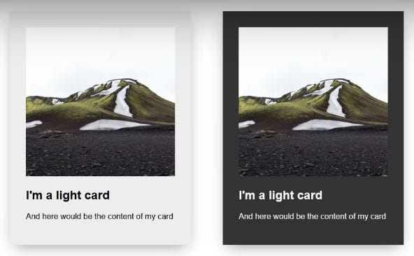

# BEM

> 参考资料：
>
> - [[YouTube] 为什么我在CSS中使用BEM命名约定](https://www.youtube.com/watch?v=SLjHSVwXYq4)
> - [BEM 命名模式](https://medium.com/ivycodefive/bem-%E5%91%BD%E5%90%8D%E6%A8%A1%E5%BC%8F-e942fd2f816a)
>
> - [BEM 快速开始](https://en.bem.info/methodology/quick-start/#should-i-create-a-block-or-an-element)

由Yandex团队提出的一种前端CSS命名方法论。

使用简洁的命名规则来描述组件及其状态，使代码易于理解、易于维护、易于扩展和重构。


## 顾名思义

- B: Block 区块
- E: Element 元素（子模块）
- M: Modifier 修饰符


## 简单例子



以这2张卡片为例：

B(Block): 整个卡片元素

E(Element): 卡片内的图片、标题、正文

M(Modifier): 主题色：亮色、暗色


## 命名方式

```
B__E--M

```

- **块（Block**）: 页面上的独立组件，具有明确的语义和功能。

  每个块都有自己的名称空间，以便与其他块进行区分。

  块名通常使用小写字母，单词之间可以使用短横线（-）分隔。 例如：`.block`、`.block-name`

- **元素（Element）**: 组成块的子元素，通常用于定义块的内部结构和样式。

  元素名称以块名称为前缀，用双下划线（__）分隔。 例如：`.block__element`、`.block-name__element-name`

- **修饰符（Modifier）**: 用于修改块或元素的行为或样式的标记。

  修饰符名称以块/元素名称为前缀，用双连字符（--）分隔。 例如：`.block--modifier`、`.block__element--modifier`、`.block-name__element-name--modifier`

了解 BEM 命名规则后，通过class名，就能一目了然它们之间的关系

以上方示例图片为例：

```
card__title
card__image
card--light
card--dark
```

## CSS预处理器

使用BEM命名法编写CSS时，一长串的class名会对开发造成比较大的困扰。搭配使用CSS预处理器，将前面重复的区块名用 `&` 符号代替，便能方便许多。

```less
.card {
  margin 2em;
  max-width: 300px;
  padding: 2em;
  box-shadow: 0 10px 30px -10px rgba(0,0,0,.45);
  &--light{
    background-color: #eee;
  }
  &--dark {
    background: #333;
    color: white;
  }
}
```

## 混合使用

在日常开发中，DOM节点一般都会比较复杂，这种开发方式允许你在单个 DOM 节点上使用不同的 BEM 实体。

```html
<div class="header">
    <!-- search-form块与header块元素混合在一起 -->
    <div class="search-form header__search-form"></div>
</div>
```

