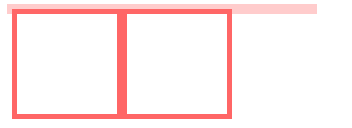
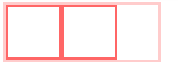
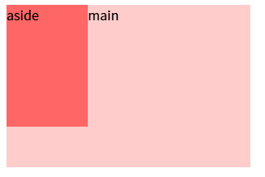
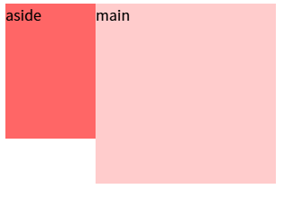
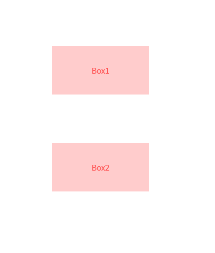
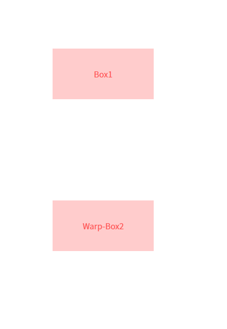

# BFC

关联：高度塌陷 / 外边距重叠 / 浮动

## 什么是BFC

我们在页面布局的时候，经常出现以下情况：

- 这个元素高度怎么没了？
- 这两栏布局怎么没法自适应？
- 这两个元素的间距怎么有点奇怪？
- ......

原因是元素之间相互的影响，导致了意料之外的情况，这里就涉及到BFC概念

BFC（Block Formatting Context），即块级格式化上下文，它是页面中的一块渲染区域，并且有一套属于自己的渲染规则：

- 内部的盒子会在垂直方向上一个接一个的放置
- 对于同一个BFC的俩个相邻的盒子的margin会发生重叠，与方向无关。
- 每个元素的左外边距与包含块的左边界相接触（从左到右），即使浮动元素也是如此
- BFC的区域不会与float的元素区域重叠
- 计算BFC的高度时，浮动子元素也参与计算
- BFC就是页面上的一个隔离的独立容器，容器里面的子元素不会影响到外面的元素，反之亦然

`BFC`目的是形成一个相对于外界完全独立的空间，让内部的子元素不会影响到外部的元素


## BFC的创建条件

包含不限于：

- 文档的根元素（`<html>`）
- 浮动元素（即 `float` 值不为 `none` 的元素）
- 绝对定位元素（`position` 值为 `absolute` 或 `fixed` 的元素）。
- `overflow` 值不为 `visible` 或 `clip` 的块级元素
- `display` 的值为 `inline-block`、`inltable-cell`、`table-caption`、`table`、`inline-table`、`flex`、`inline-flex`、`grid`、`inline-grid`
- ...

完整列表可见：[mdn文档](https://developer.mozilla.org/zh-CN/docs/Web/CSS/CSS_display/Block_formatting_context)


## 应用场景

格式化上下文影响布局，通常，我们会为定位和清除浮动创建新的 BFC，而不是更改布局，因为它将：

- 包含内部浮动
- 排除外部浮动
- 阻止外边距重叠


### 包含内部浮动

```html
<style>
    .par {
        border: 5px solid #fcc;
        width: 300px;
    }
 
    .child {
        border: 5px solid #f66;
        width:100px;
        height: 100px;
        float: left;
    }
</style>

<body>
    <div class="par">
        <div class="child"></div>
        <div class="child"></div>
    </div>
</body>
```



由于子元素浮动，且父元素未使用 `BFC` ，导致父元素高度塌陷。

而 `BFC` 在计算高度时，浮动元素也会参与，所以我们可以触发 `.par` 元素使用 `BFC`，则内部浮动元素计算高度时候也会计算。

Tip: 多层嵌套关系下，祖先元素启用 `BFC` 也能将内部浮动元素的高度计入。

```css
.par {
	overflow: hidden; /* [!code highlight] */
}

```





### 排除外部浮动

这里举例一个两栏的布局

```html
<style>
    body {
        width: 300px;
        position: relative;
    }
 
    .aside {
        width: 100px;
        height: 150px;
        float: left;
        background: #f66;
    }
 
    .main {
        height: 200px;
        background: #fcc;
    }
</style>

<body>
    <div class="aside">aside</div>
    <div class="main">main</div>
</body>
```



由于前面提到的浮动特性：每个元素的左外边距与包含块的左边界相接触

因此，虽然 `aside` 是浮动元素，`main` 元素的左边依然会包含块的左边相接触

而使用了 `BFC` 的区域不会与浮动容器重叠

我们可以为 `main` 元素启用 `BFC`，以适应两栏布局

```css
.main {
    overflow: hidden; /* [!code highlight] */
}
```




### 阻止外边距重叠

```html
<style>
    p {
        color: #f55;
        background: #fcc;
        width: 200px;
        line-height: 100px;
        text-align:center;
        margin: 100px;
    }
</style>

<body>
    <p>Box1</p >
    <p>Box2</p >
</body>
```



2个 `p` 元素之间的距离仅为 `100px`，发生了margin重叠，重叠时，以margin最大的为准。

前面讲到，同一个 `BFC` 中的俩个相邻的盒子的 `margin` 会发生重叠。

可以在`p`外面包裹一层容器，并触发这个容器生成一个`BFC`，那么两个`p`就不属于同一个`BFC`，则不会出现`margin`重叠。

```html
<style>
    .wrap {
        overflow: hidden;// 新的BFC
    }
    p {
        color: #f55;
        background: #fcc;
        width: 200px;
        line-height: 100px;
        text-align:center;
        margin: 100px;
    }
</style>

<body>
    <p>Box1</p >
    <div class="wrap">
        <p>Wrap-Box2</p >
    </div>
</body>
```




## 参考

- https://developer.mozilla.org/zh-CN/docs/Web/Guide/CSS/Block_formatting_context
- https://github.com/zuopf769/notebook/blob/master/fe/BFC%E5%8E%9F%E7%90%86%E5%89%96%E6%9E%90/README.md