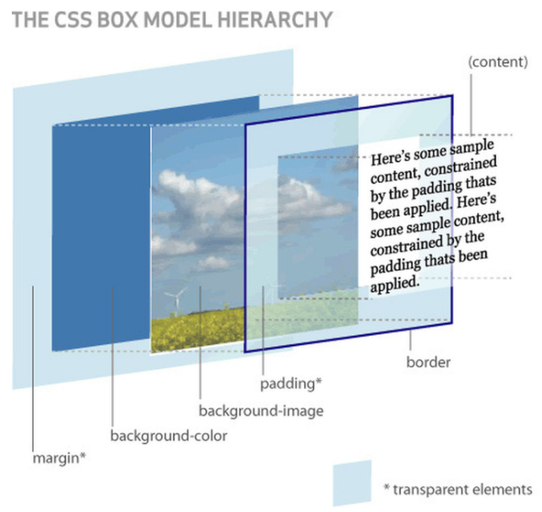

# 盒模型

当对一个文档进行布局（layout）的时候，浏览器的渲染引擎会根据标准之一的 CSS 基础框盒模型（CSS basic box model），将所有元素表示为一个个矩形的盒子（box）。

CSS 决定这些盒子的大小、位置以及属性（例如颜色、背景、边框尺寸…）。

一个盒子由四个部分组成：

- 内容边界 (Content edge)
- 内边距边界 (Padding Edge)
- 边框边界 (Border Edge)
- 外边框边界 (Margin Edge)


## 盒模型组成



### 内容区域

容纳着元素的“真实”内容，即实际内容，显示文本和图像等内容。它的尺寸为内容宽度和内容高度。它通常含有一个背景颜色（默认透明）或背景图像。

如果 `box-sizing` 为 `content-box` (默认)，则内容区域可以明确地通过 `width` 、`height`  等相关属性控制。


### 内边距区域

由内边距边界限制，扩展自内容区域，负责延伸内容区域的背景，填充元素中内容与边框的间距。


### 边框区域

即边框，由边框边界限制，扩展自内边距区域的一条或多条线，由粗细、样式、颜色三部分组成。

边框的粗细由 `border` 相关属性控制。如果 `box-sizing` 属性被设为 `border-box` ，那么边框区域的大小可明确地通过 `width`、`height` 等相关属性控制。假如框盒上设有背景（`background-color` 或 `background-image`），背景将会一直延伸至边框的外沿（默认为在边框下层延伸，边框会盖在背景上）。此默认表现可通过 CSS 属性 `background-clip` 来改变。


### 外边距区域

由外边距边界限制，用空白区域扩展边框区域，以分开相邻的元素。

> [!WARNING]
> 在发生外边距合并的情况下，由于盒之间**共享外边距**，外边距不容易弄清楚。

>  [!WARNING]
> 请注意，除可替换元素外，对于**行内元素**来说，尽管内容周围存在内边距与边框，但其占用空间（每一行文字的高度）则由 `line-height` 属性决定，即使边框和内边距仍会显示在内容周围。


## 盒模型种类

```html
<style>
  .box {
    width: 200px;
    height: 100px;
    padding: 20px;
  }
</style>
<div class="box">
  Box
</div>
```

当我们在浏览器查看元素时，却发现元素的大小变成了`240px`

这是因为，在`CSS`中，盒子模型可以分成：

- W3C 标准盒模型
- IE 怪异盒模型

默认情况下，盒子模型为`W3C` 标准盒模型

我们可以通过 `box-sizing` 控制使用哪一种盒模型

```css
.box{
    box-sizing: content-box | border-box;
}
```


### 标准盒模型

content-box


从上图可以看到：

- 盒子总宽度 = width + padding + border + margin
- 盒子总高度 = height + padding + border + margin

也就是， `width/height` 只是内容高度，不包含 `padding` 和 `border`值。

设置`width`为200px，但由于存在`padding`，但实际上盒子的宽度有240px


### 怪异盒模型

border-box


从上图可以看到：

- 盒子总宽度 = width + margin;
- 盒子总高度 = height + margin;

也就是，`width/height` 包含了 `padding`和 `border` 值


## 实践经验

### 一般情况下选用什么盒模型？

在开发实践中，不改动盒模型的情况下，调整一个元素的宽度和高度时需要时刻注意到这个元素的边框和内边距。当我们实现响应式布局时，这个特点尤其烦人。

大多情况下会将 `box-sizing` 调整为 `border-box` ，这使得处理元素大小的工作变得容易得多，并且通常消除了在布局内容时可能遇到的许多陷阱。