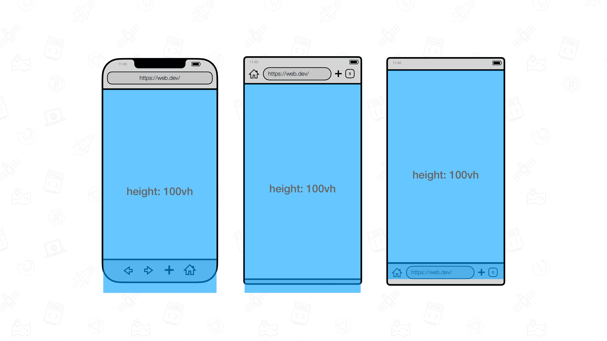
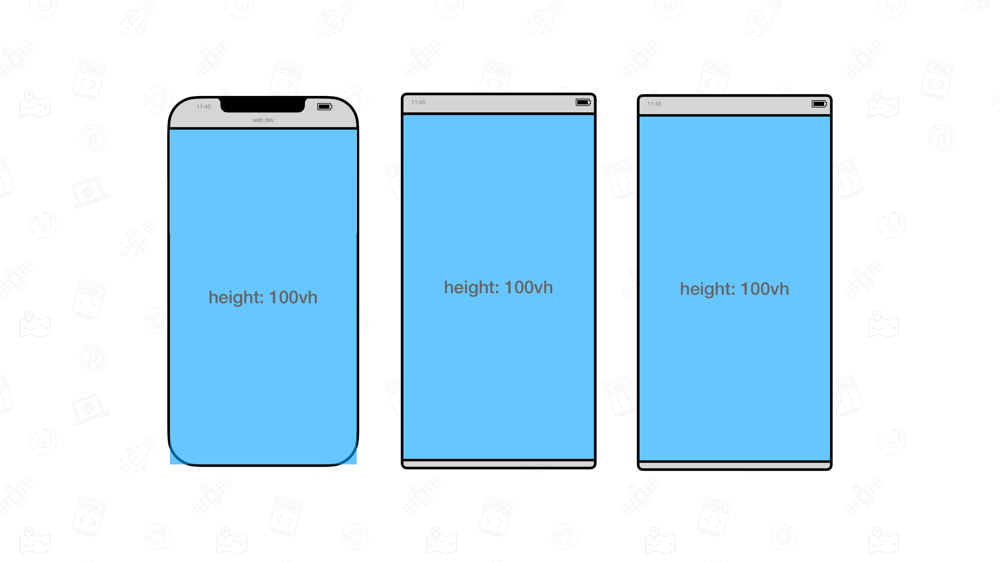
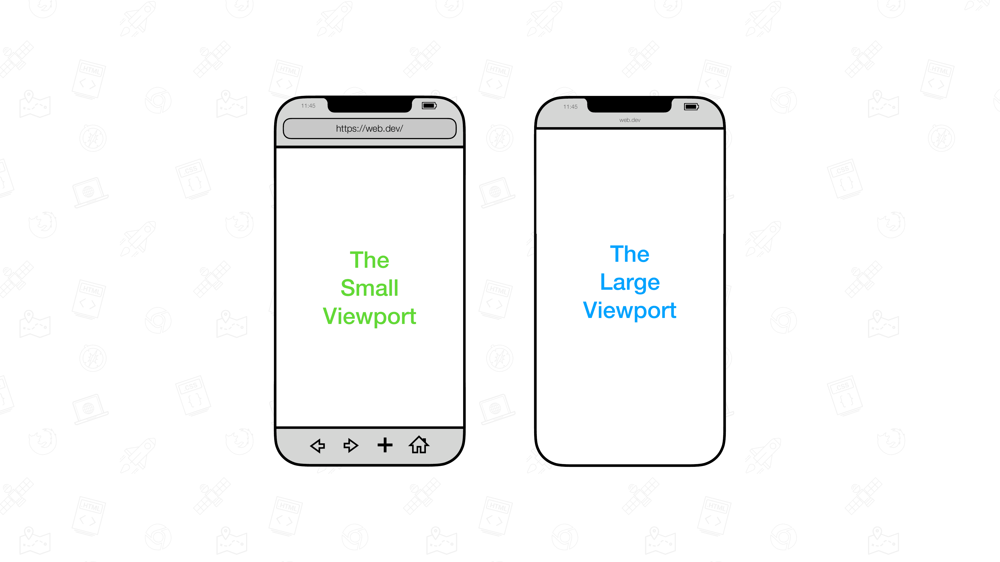

# 在移动端避免使用100vh

> 参考资料：
>
> [Avoid 100vh On Mobile Web](https://chanind.github.io/javascript/2019/09/28/avoid-100vh-on-mobile-web.html)
>
> [The trick to viewport units on mobile](https://css-tricks.com/the-trick-to-viewport-units-on-mobile/)
>
> [The large, small, and dynamic viewport units](https://web.dev/blog/viewport-units?hl=zh-cn)

## 问题分析

移动浏览器在计算 100vh 的高度的时候，会把地址栏等相关控件的高度计算在内，从而破坏了 `100vh` 的样式设计。

动态工具栏可见时：

向下滚动时，这些动态工具栏会收起。在这种状态下，高度设为 `100vh` 的元素将覆盖整个视口。

动态工具栏收起时：

## 解决方案

为解决此问题，在 CSS 工作组指定了视口的各种状态。

- **大视口**：假设所有 UA 界面会动态展开和收起而处于收起状态的视口。
- **小型视口**：假设所有 UA 界面会动态展开和收起来展开的 UA 界面的尺寸。

系统也为新视口分配了单位：

- 表示**大视口**的单位带有 `lv` 前缀。单位包括 `lvw`、`lvh`、`lvi`、`lvb`、`lvmin` 和 `lvmax`。
- 表示**小视口**的单位带有 `sv` 前缀。单位包括 `svw`、`svh`、`svi`、`svb`、`svmin` 和 `svmax`。

除非视口本身调整大小，否则这些视口百分比单元的尺寸是固定的（因此是稳定的）。

除了大和小视口之外，还有一个**动态视口**，用于动态考虑 UA 界面：

- 当动态工具栏展开时，动态视口与小视口的大小相等。
- 当动态工具栏收起时，动态视口与大视口的大小相等。

附带的单元带有 `dv` 前缀：`dvw`、`dvh`、`dvi`、`dvb`、`dvmin` 和 `dvmax`。它们的尺寸介于对应的 `lv*` 和 `sv*` 对应项之间。

这些新单元在 Chrome 108 更新后可用

> [!NOTE]
> **注意** ：在没有动态 UA 界面的浏览器（例如桌面版 Chrome）中，大、小和动态视口的大小是相同的。
