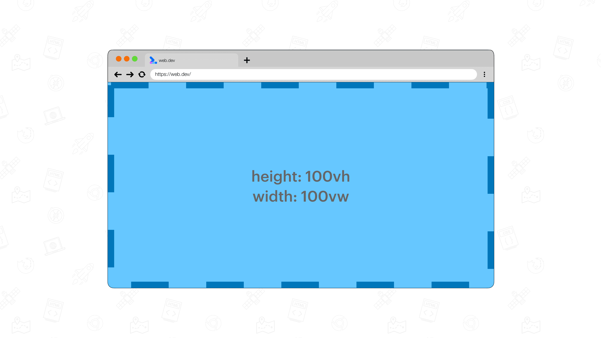
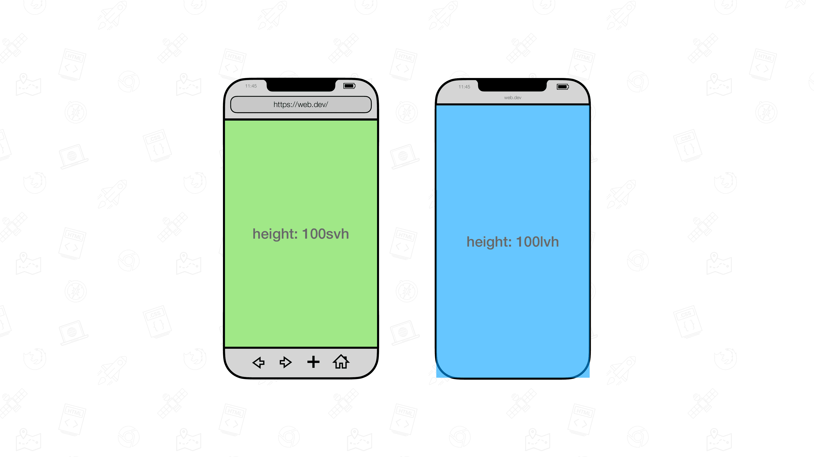
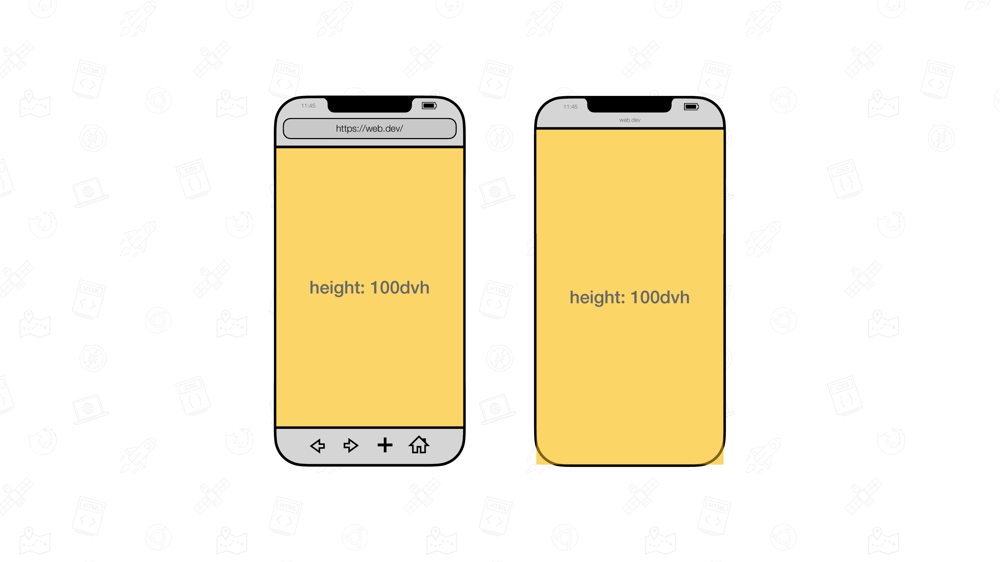

# CSS 视口单位

CSS 中有6个不同的视口单位、3个独特的修饰符，总计提供24种组合。

若要设置为与视口一样高，可以使用 `vw` 和 `vh` 单位。

- `vw` = 视口尺寸宽度的 1%。
- `vh` = 视口大小高度的 1%。

将元素的宽度设置为 `100vw`，高度设置为 `100vh`，它就会完全覆盖视口。

## 主要单位

| 单位 | 名称             | 描述                     |
| ---- | ---------------- | ------------------------ |
| vw   | viewport width   | 视口宽度；1vw=1%视口宽度 |
| vh   | viewport height  | 视口高度；1vh=1%视口高度 |
| vmin | viewport minimum | `vw` 或 `vh` 中的较小者  |
| vmax | viewport maximum | `vw` 或 `vh` 中的较大者  |
| vi   | viewport inline  | 视口内联方向大小的 1%    |
| vb   | viewport block   | 视口块级方向大小的 1%    |

## 修饰符

在 Chrome 108 更新中，加入了修饰符用于解决移动端环境的视口大小问题。

| 前缀 | 名称             | 描述                           |
| ---- | ---------------- | ------------------------------ |
| lv*  | Large Viewport   | 所有 UA 界面处于收起状态的视口 |
| sv*  | Small Viewport   | 所有 UA 界面处于展开状态的视口 |
| dv*  | Dynamic Viewport | 根据 UA 界面动态计算的视口     |

### 大视口、小视口

### 动态视口

dvh 会自行调整为大或小视口大小.

